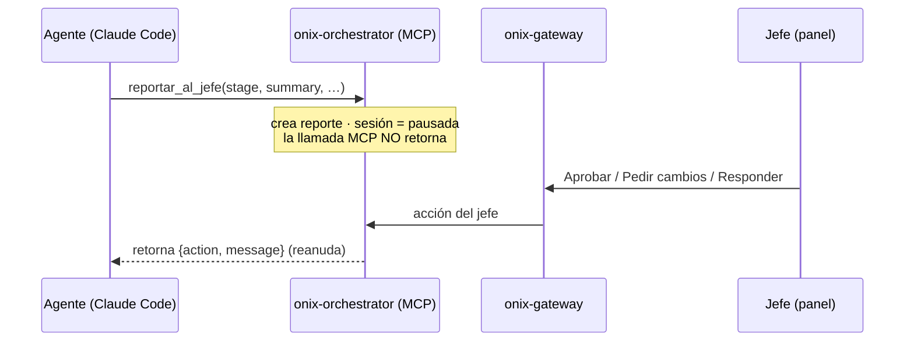

# onix-orchestrator

**Plano de control** de OnixGuard. Escrito en **Go**. Expone el **servidor MCP** que usan los agentes, maneja la **pausa/reanudación**, el flujo de **12 etapas** y las **alertas**; a futuro, el canal de control remoto de la PC.

> **Estado:** se construye en **Fase 3**. Este README documenta su diseño.

---

## Responsabilidad



## Herramientas MCP (para los agentes)

- **`reportar_al_jefe(stage, summary, deliverables[], decisions[])`** → crea el reporte, marca la sesión `pausada` y **no retorna** hasta que el jefe responde; devuelve `{action, message}`.
- **`pedir_al_jefe(question)`** → mismo patrón bloqueante; devuelve `{message}`.
- **`consultar_plan()`** → devuelve el plan de 12 etapas y la etapa actual.

Los shapes de entrada/salida están en `onix-contracts/schemas/mcp.methods.schema.json`.

## Cómo funciona la pausa

Pausar/reanudar = **la llamada MCP se bloquea** (con timeout configurable y estado persistido en `sessions.status`), **no** se mata el proceso del agente. La respuesta del jefe llega vía `onix.ctrl.<sesión>` y retorna la llamada pendiente.

> ⚠️ Riesgo de red: Cloudflare corta conexiones idle (~100s). El MCP bloqueante necesita heartbeat/long-poll o timeouts altos en nginx/Cloudflare (ver `onix-deploy`).

## Contratos

- **Expone:** servidor MCP (HTTPS autenticado) + publica en `onix.ctrl.*`.
- **Lee/escribe:** Postgres (`reports`, `messages`, `sessions`, `stages`).
- **Recibe** acciones del jefe reenviadas por `onix-gateway`.
- **Importa:** `github.com/levapo97-cell/onix-contracts/go/onixcontracts`.

## Estructura (futura)

```text
cmd/onix-orchestrator/main.go
internal/mcp/  internal/ctrl/  internal/store/
Dockerfile
```

---

*Parte de OnixGuard. Ver el plan en `OnixGuard/docs/PLAN.md` §1, §4 (MCP), §6 (flujo) y §7.*
